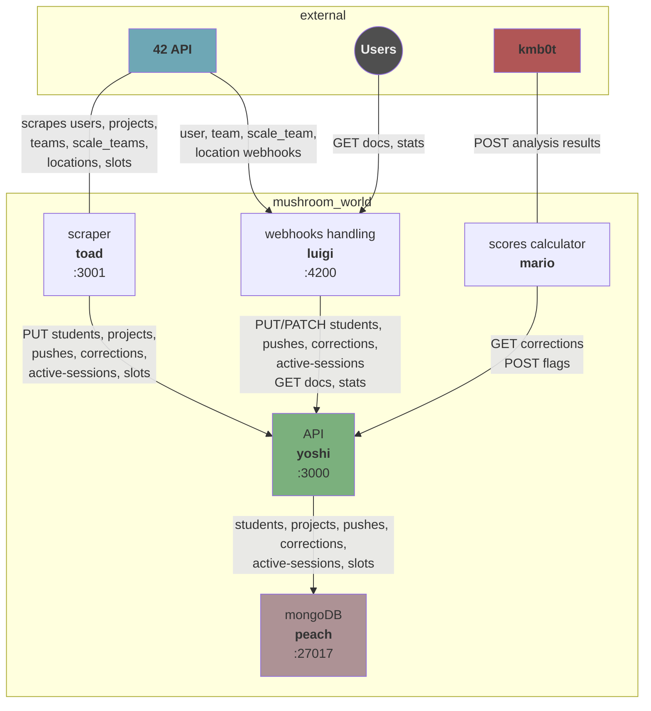

<div id="top"></div>

<!-- INTRODUCTION -->
<br />
<div align="center">

  <h3 align="center">Mushroom World</h3>

  <p align="center">
    A detection system designed to highlight suspicious peer correction behaviors and potential favoritism among students, developed for 42 Mulhouse.
  </p>
  <p align="center">
    This project is a revamped version of the comprehensive and high-quality 
    <a href="https://gitlab.42mulhouse.fr/bdehais/luigi">mario+luigi</a> & 
    <a href="https://gitlab.42mulhouse.fr/bguyot/api.42mulhouse.fr">peach</a> projects, originally built by 
    <a href="https://profile.intra.42.fr/users/bdehais">bdehais</a> & 
    <a href="https://profile.intra.42.fr/users/bguyot">bguyot</a>.
  </p>

</div>


<!-- TABLE OF CONTENTS -->
<details>
  <summary style="font-size: 1.2em;font-weight: bold">Table of Contents</summary>
  <ol>
    <li><a href="#architecture">Architecture</a></li>
    <li>
      <a href="#getting-started">Getting Started</a>
      <ul>
        <li><a href="#docker-prerequisites">Docker Prerequisites</a></li>
        <li><a href="#installation">Installation</a></li>
        <li><a href="#roles">Roles</a></li>
      </ul>
    </li>
    <li><a href="#usage">Usage</a></li>
    <li><a href="#kmb0t-webhook">kmb0t Webhook</a></li>
    <li><a href="#contact">Contact</a></li>
  </ol>
</details>

<!-- ARCHITECTURE -->

## Architecture 🏗️

Mushroom World is a microservices-based system composed of five main services that work together to detect suspicious correction patterns:




<!-- GETTING STARTED -->

## Getting Started

### Docker Prerequisites

Having Docker installed on your machine is required to run the system. If you don't have it, you can install it by following the instructions on the [official website](https://docs.docker.com/get-docker/).

### Installation

**❗️ You'll need to create a `.env` file in the root directory with all the required environment variables ❗️**

1. Clone the repository

    ```sh
    $> git clone ssh://git@gitlab.42mulhouse.fr:422/nlederge/mushroom_world.git
    $> cd mushroom_world
    ```

2. Create a `.env` file based on the `.template.env` file.

    ```sh
    $> cp .template.env .env
    ```

3. Start the services using Docker Compose

    ```sh
    $> docker compose up -d --build
    ```

    The services will start in the correct order. Once all services are healthy, the system is ready to use.

### Roles & scopes

The `42 API` key specified in the `.env` file must have the following roles: `Basic Tutor`, `Advanced Tutor` and `Basic Staff` to access the necessary endpoints.

It must also have the following scopes: `public projects`.

Please refer to the [42 API documentation](https://api.intra.42.fr/apidoc) for more information.

## Usage

The system automatically:
- Receives webhooks from the 42 API via `Luigi`
- Scrapes data from the 42 API via `Toad`
- Provides REST API endpoints via `Yoshi` for data management
- Stores all data in `Peach` (MongoDB)
- Calculates suspicious behavior flags via `Mario`
- Sends notifications to `kmb0t` when suspicious patterns are detected
- Lists available Yoshi API endpoints at `/docs`
- Provides the number of students, projects, pushes, corrections and flags handled at `/stats`

## kmb0t Webhook

When `Mario` processes a correction, it sends a `POST` request to `{KMB0T_URL}/h/campus` with a structured JSON payload.

The handling logic on the `kmb0t` side can be found [here](https://gitlab.42mulhouse.fr/Yohan/kmb0t/-/blob/main/src/students/mario_hook.py).

### Payload structure

| Field | Description |
|-------|-------------|
| `type` | always `"mario"` |
| `correction` | correction metadata (id and begin_at) |
| `corrector` | who performed the correction (id and login) |
| `correcteds` | array of students being corrected (id and login) |
| `project` | project being evaluated (id and name) |
| `analysis.suspicious` | `true` if any sufficient flag was triggered |
| `analysis.final_score` | average of all flag values |
| `analysis.triggered_count` | number of flags above their threshold |
| `analysis.total_flags` | total number of flags calculated |
| `analysis.flags` | array of detailed results for each flag (value, is_triggered, sufficient, description and details) |

#### Authentication

Mario authenticates webhook requests using the `X-Auth-Token` HTTP header containing the value of `KMB0T_AUTH_TOKEN`.

<!-- CONTACT -->

## Contact

42born2code Slack and 42Intra:

-   nlederge - [nlederge](https://profile.intra.42.fr/users/nlederge)

<p align="right">(<a href="#top">back to top</a>)</p>
